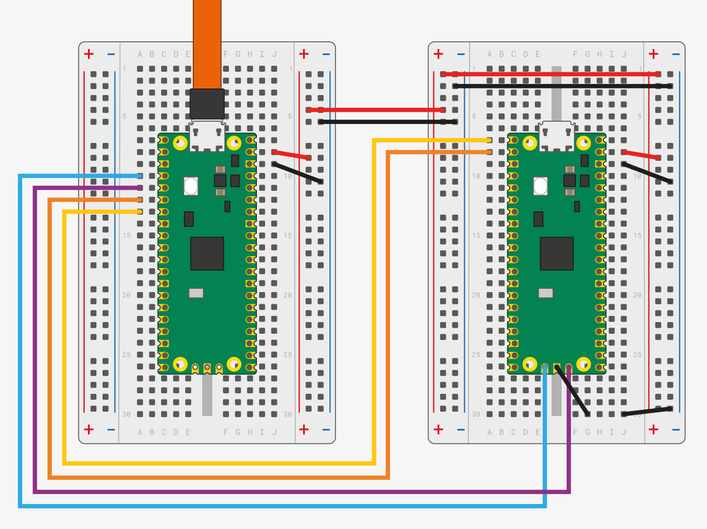

# Lab 2 - RTOS Basics 

Welcome to lab 2! In this lab we will start using Zephyr RTOS to get a feeling for programming with a real-time operating system. 

## Requirements 

For this lab, you will need a working Zephyr installation.
If you are using your own computer you can find the installation instructions [here](https://docs.zephyrproject.org/latest/develop/getting_started/index.html).

**Be aware that Zephyr does not permit spaces in the installation path** 

For part 3 you will also need a terminal program, such as minicom, screen, or Putty.

**You cannot use Pico SDK for this lab.**
Hence, we advise against using the VSCode Rasberry Pico extension.

## Template 
 
You can download the template for this lab from Studium! There is a subfolder for each part. 

## Resources

Here are resources you might find helpful during this lab:

- [Kernel services](https://docs.zephyrproject.org/latest/kernel/services/index.html):  tasks, mutexes, semaphores, queues, etc. 
- [Devicetree HOWTOs](https://docs.zephyrproject.org/latest/build/dts/howtos.html#dt-howtos)
- [Raspberry Pi Pico Board Support](https://docs.zephyrproject.org/latest/boards/raspberrypi/rpi_pico/doc/index.html): build instructions, debugging, etc.
- [debugprobe UF2 file](https://www.raspberrypi.com/documentation/microcontrollers/pico-series.html#debugging-using-another-pico-series-device): for debugging, UART-USB bridge
- [Zephyr demo applications](https://github.com/zephyrproject-rtos/zephyr/tree/main/samples)
- [Zephyr peripheral APIs](https://docs.zephyrproject.org/latest/hardware/peripherals/index.html): drivers for GPIO, I2C, UART, etc. 
- [West documentation](https://docs.zephyrproject.org/latest/develop/west/index.html): West is the command line tool used to build Zephyr applications 
- [Zephyr Application Development Guide](https://docs.zephyrproject.org/latest/develop/application/index.html#building-an-application): Describes folder layout for new applications and detailed build instructions
- [Zephyr video tutorial by The Pull-up Resistor Channel](https://www.youtube.com/watch?v=Z_7y_4O7yTw&list=PLEQVp_6G_y4iFfemAbFsKw6tsGABarTwp): Excellent video playlist which covers Zephyr and helps demystify device trees!

You might also want to check the example applications we covered in class ([blinky][zephyr_blinky] and [deferred interrupt processing][zephyr_isr]).
You are free to copy/use the applications' code in your assignment.

<div style="page-break-before:always"></div>

## Building an application 

To build an application you use the **west** command line tool. A link to its documentation is given in the section above. In general, to build an application you have to navigate to the folder that holds the application's **CMakeLists.txt** file and issue 

```bash 
west build -b rpi_pico
``` 

This will automatically create a `/build` folder in the current directory and start compiling your application. West has many optional flags (such as the `-b rpi_pico`) so it is worth looking into the documentation which ones might be interesting for you! 

If west fails to build your project with an error about a missing "build" command you probably have not set all required environment variables. This can usually be solved by sourcing the *zephyr-env.sh* (Linux, macOS) or *zephyr-env.cmd* (Windows) file in the `/zephyrproject/zephyr/` folder. 

You can program your board as you did in lab 1 by copying the resulting .uf2 file (located at `../build/zephyr/zephyr.uf2`) onto the USB device that shows up when you start your board in boot mode. 

You can also use **west flash** by connecting the picoprobe debugger and building your project as outlined in the [Raspberry Pi Pico Board Support](https://docs.zephyrproject.org/latest/boards/raspberrypi/rpi_pico/doc/index.html) page.
Notice that you can set build variables (such as `-DOPENOCD`) permanently in your application's `CMakeLists.txt` file (outlined [here](https://docs.zephyrproject.org/latest/develop/west/build-flash-debug.html#permanent-cmake-arguments)).

Hint: Before getting started on the tasks we **strongly adivse** that you first build/run the lecture examples, to ensure everything is set up correctly (setting up Zephyr can be difficult).
Then you can proceed with the assignment.

## Part 1 - Extended Blinky

The goal of this part is to get 4 LEDS to blink with different frequencies, i.e. with an ON/OFF delay of 100, 200, 300, and 500ms respectively.
You should define a different task for each of the LEDs. 

You can freely choose which LEDs you want to use. In order to use them with Zephyr you will have to adapt the devicetree for you application.
You can have a look at the example blinky application which we did in the lecture and read the section about [devicetree overlays](https://docs.zephyrproject.org/latest/build/dts/howtos.html#set-devicetree-overlays) in the Zephyr documentation. 

Hint: You can use the same **entry function** for all tasks, giving the LED and the delay as input arguments.

## Part 2 - Interrupts, Semaphores, Mutexes

In this part of the assignment you shall create a program that always blinks one of 4 LEDs.
To switch between different LEDs, use the first button (GP20). You don't have to care about the state of the other LEDs that are currently not blinking (e.g. they can be ON or OFF).

It is up to you to decide which LEDs you want to use.
You will also have to include the button in the devicetree for this part!

**You must use both a semaphore and a mutex in this part of the assignment**

Hints:

- There should be two tasks in this system, one handling the blinking, and one handling the button presses 
- Use deferred interrupt handling. The button interrupt routine should only give a signal to the button handler task indicating that the button was pressed
- Pay attention to guard any access to shared variables 

## Part 3 - Three second game 

In this last part of the assignment you shall create a time estimation game. The user shall be prompted (via the terminal), to push the first button.
The idea is to push the same button again after exactly 3 seconds. 
The program shall give the user feedback on how close they were to 3 seconds. There are many ways of how to implement this. Be creative!

Hint: 

To read the output from your `printf` statements you will need to use a UART-USB bridge. 
[debugprobe](https://www.raspberrypi.com/documentation/microcontrollers/pico-series.html#debugging-using-another-pico-series-device) implements such a bridge along with debugging support.
You can deploy the debugprobe on the second Pico board, which you then connect to the main board according to the diagram shown in Appendix A of the [Getting started guide](https://datasheets.raspberrypi.com/pico/getting-started-with-pico.pdf), diagram which is also included here for convenience.
With this connection, your print-outs are relayed to your computer, indirectly via the second Pico board.
You can then view these print-outs in a console (see section "Use the UART" of the same document).



If you use the debugprobe as a UART-USB bridge, you have to connect the UART TX and RX signal lines (orange and yellow wire) and ground.  If you don't want to debug/program with the debugprobe you can leave away the blue, purple, and red wires.
If you want to program your device without debugprobe you will want to use two USB cables (one for each Pico) in this setup!

The Kconfig file in the template (`prj.conf`) enables [Newlib](https://docs.zephyrproject.org/latest/develop/languages/c/newlib.html), a complete C library implementation.
This gives you access to full-fledged implementations of statements such as `printf`.
If you use such statements, don't forget to flush the output buffer after printing (e.g., using `fflush(stdout)`) otherwise you might not see any output!
Alternatively, you can use [`printk`](https://docs.zephyrproject.org/apidoc/latest/printk_8h.html), which does not require flushing but supports only basic format specifiers.

[zephyr_blinky]: https://github.com/uu-pes/zephyr_blinky_example
[zephyr_isr]: https://github.com/uu-pes/zephyr_deferred_interrupt_processing

